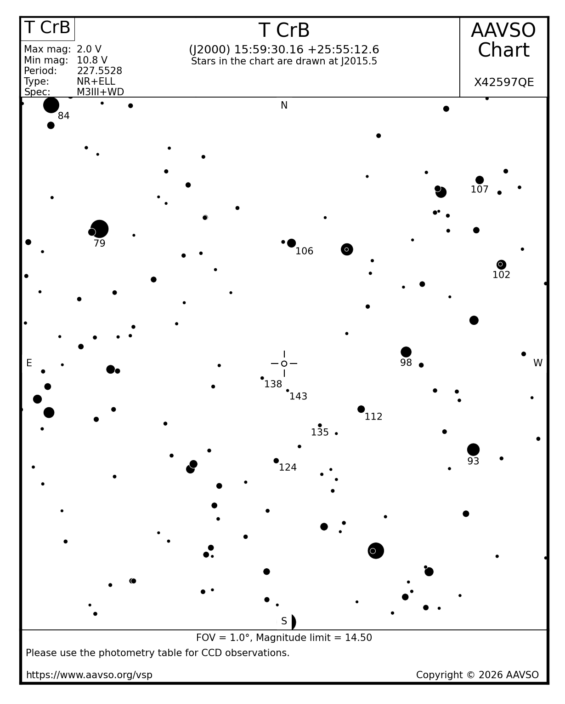

# T CrB Finder Chart

AAVSO chart X42597QE — 1° FOV, magnitude limit 14.50, J2000 15h 59m 30.2s +25° 55′ 12.6″. Comparison star magnitudes are in units of 0.1 mag (e.g. "106" = 10.6 V).

## Comparison star V magnitudes

| Label | AUID | RA | Dec | V mag | ± |
|------:|------|----|----|------:|---|
| 79 | 000-BBW-881 | 16:01:03.91 | +26:10:20.7 | 7.886 | 0.032 |
| 84 | 000-BBW-888 | 16:01:28.59 | +26:24:16.5 | 8.361 | 0.021 |
| 93 | 000-BBW-787 | 15:57:54.56 | +25:45:29.9 | 9.307 | 0.036 |
| 98 | 000-BBW-796 | 15:58:28.42 | +25:56:30.9 | 9.809 | 0.023 |
| 102 | 000-BBW-779 | 15:57:40.02 | +26:06:18.8 | 10.167 | 0.010 |
| 106 | 000-BJS-901 | 15:59:26.42 | +26:08:47.1 | 10.554 | 0.023 |
| 107 | 000-BBW-782 | 15:57:51.04 | +26:15:51.2 | 10.736 | 0.024 |
| 112 | 000-BBW-805 | 15:58:51.22 | +25:50:05.0 | 11.166 | 0.019 |
| 124 | 000-BPC-198 | 15:59:34.20 | +25:44:17.3 | 12.366 | 0.014 |
| 135 | 000-BPC-228 | 15:59:12.10 | +25:48:16.3 | 13.477 | 0.066 |
| 138 | 000-BPC-218 | 15:59:41.28 | +25:53:35.4 | 13.791 | 0.061 |
| 143 | 000-BPC-229 | 15:59:28.42 | +25:52:11.3 | 14.342 | 0.056 |
