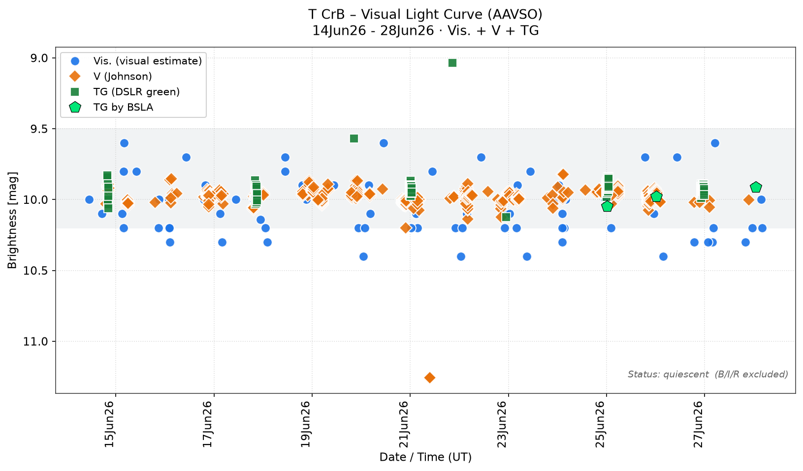

# T CrB Monitor

> **Next predicted eruption window: 25 June 2026**
> Despite several past predictions that did not pan out, current analysis of T CrB's pre-nova dimming behaviour points to **25 June 2026** as the next most likely date for the eruption. Keep watching!

Alert when T Coronae Borealis (T CrB) erupts after 80 years of quiescence.
Polls the AAVSO WebObs database (AUID 000-BBW-825). Standard library only, no external packages.

## What it does

- Fetches the latest 200 observations and appends them deduplicated to `tcrb_history.csv` (all bands, for your own analysis).
- Evaluates thresholds on Vis. and V observations only — the M-giant companion keeps T CrB permanently ~7 mag in the I/R bands, which would otherwise cause constant false alarms. 
  - TG (transformed Green, a green-channel DSLR filter approximating V) is excluded because it tracks closely with V but adds calibration scatter; V and Vis. observations are sufficient and cleaner for threshold detection.
- Two levels: `--warn-mag 8.0` (notable) and `--erupt-mag 6.0` (eruption likely). Alerts only on escalation; `tcrb_state.json` prevents duplicate notifications.
- Alerts via macOS notification (`osascript`) and optionally via Signal.

## Usage

```bash
python3 tcrb_monitor.py             # normal run
python3 tcrb_monitor.py --dry-run   # fetch and display only, no writes
python3 tcrb_monitor.py --test-alert  # send test message on all active channels
```

## Setup

Place the script and plist in a fixed location and update all `/Users/USERNAME/Scripts/tcrb` paths in the plist to match your setup. `which python3` shows the correct interpreter path — `/usr/bin/python3` is Apple's system Python and is sufficient since the script uses only the standard library.

```bash
mkdir -p ~/Scripts/tcrb
cp tcrb_monitor.py ~/Scripts/tcrb/
cp config.py ~/Scripts/tcrb/          # secrets; launchd loads from WorkingDirectory
cp de.agorion.tcrb.plist ~/Library/LaunchAgents/

# validate syntax (no output = ok)
plutil -lint ~/Library/LaunchAgents/de.agorion.tcrb.plist

# load (modern syntax; "gui/$(id -u)" is your login session)
launchctl bootstrap gui/$(id -u) ~/Library/LaunchAgents/de.agorion.tcrb.plist

# trigger immediately without waiting for the next hour
launchctl kickstart -k gui/$(id -u)/de.agorion.tcrb
```

Check whether it is running:

```bash
launchctl print gui/$(id -u)/de.agorion.tcrb | grep -i state
cat ~/Scripts/tcrb/tcrb.log
```

To reload after plist changes, unload first then load again:

```bash
launchctl bootout gui/$(id -u)/de.agorion.tcrb
launchctl bootstrap gui/$(id -u) ~/Library/LaunchAgents/de.agorion.tcrb.plist
```

## Two notes

- The plist fires hourly on the hour, around the clock — sensible because eruption reports arrive worldwide at any time and T CrB fades quickly after peak. If that is too frequent, `StartCalendarInterval` can be written as an array of specific hours (e.g. 6, 12, 18, 22 only).
- The macOS notification via `osascript` runs from the LaunchAgent inside your GUI session and normally appears without issue; on first run you may need to grant permission under System Settings → Notifications. If notifications feel too unreliable, Signal delivery is the more robust channel — every hour counts when an eruption happens.

## Signal alerts

Fill in `config.py` (template: `config.sample.py`):

- `SIGNAL_CLI` — verify path with `which signal-cli` (Apple Silicon usually `/opt/homebrew/bin/signal-cli`)
- `SIGNAL_ACCOUNT` — your linked phone number
- Either `SIGNAL_GROUP_ID` (takes priority) or `SIGNAL_RECIPIENTS`
- `SIGNAL_ENABLED` is set in the script header and defaults to `True`; if `config.py` is missing, Signal disables itself automatically.

Two more things: the signal-cli path must be absolute because launchd provides only a minimal PATH. And signal-cli stores its state in `~/.local/share/signal-cli` — since the LaunchAgent runs under your user account, this works without extra configuration.

## Setting up signal-cli

```bash
brew install signal-cli
signal-cli link -n "TCrB-Monitor"          # shows a QR code; scan in Phone → Settings → Linked Devices
signal-cli -u +1YOURNUMBER receive         # run once to fetch contacts and groups
signal-cli -u +1YOURNUMBER listGroups      # returns the base64 group ID
```

Linking (rather than registering) is the easier path: your phone stays the primary device and the Mac becomes a secondary linked device.

## Testing

```bash
python3 tcrb_monitor.py --test-alert
```

This sends a clearly marked test message on all active channels and exits without changing state — ideal for verifying Signal delivery before going live.

## Plotting the light curve

The script `plot_tcrb_csv.py` reads `tcrb_history.csv` and produces `tcrb_lightcurve.png` — a visual light curve with Vis., V, and TG band measurements. B, I, R, CV, and SU are excluded (I/R: permanently bright M-giant; B: systematically offset). Fainter-than limits are also skipped. The x-axis shows UTC date/time derived from Julian Dates; the y-axis is inverted as usual (brighter up). The title shows the date range of the available data automatically.

```bash
.venv/bin/python plot_tcrb_csv.py
```

Requires `matplotlib`. Create a virtual environment with:

```bash
python3 -m venv .venv
.venv/bin/pip install matplotlib
```

The plotter reads the production CSV path from `de.agorion.tcrb.plist` (`WorkingDirectory`) if the plist is present — otherwise from the script directory.



## Links

- [T CrB current – TheSkyLive](https://theskylive.com/sky/stars/hr-5958-star) — live brightness and current information on T Coronae Borealis
- [AAVSO Photometry Database Search](https://apps.aavso.org/v2/data/search/photometry/) — search raw data from all AAVSO observations
